# 🌉 Bridge Me Not

**Unite Hackathon 2025 Project**  
Cross-chain atomic swaps with 1inch Fusion & Lightning Network


---

## 🏆 Hackathon Pitch

### 🎯 The Problem
Cross-chain swaps are complex, expensive, and provide poor user experience. Users face:
- Multiple transaction confirmations across different chains
- High gas fees and slippage
- Complex interfaces requiring technical knowledge
- Limited cross-chain liquidity options

### 💡 Our Solution
**Bridge Me Not** simplifies atomic swaps while maintaining full compatibility with 1inch protocols, introducing revolutionary Lightning Network integration for instant Bitcoin transactions.

### ⚡ Innovation Highlights
- **First-ever Lightning Network + 1inch protocol integration**
- **Native Etherlink support** for seamless Tezos L2 operations
- **Simplified HTLC implementation** with deterministic addressing
- **One-click cross-chain swaps** with institutional-grade security

---

## 🚀 Partner Technologies

### 🔄 1inch Integration
- **Fusion API**: Advanced order routing and aggregation
- **Limit Order Protocol**: Gasless orders with efficient execution
- **Adapter Pattern**: Seamless integration with existing 1inch infrastructure

### ⚡ Lightning Network
- **Bitcoin ↔ EVM atomic swaps**: Direct BTC to any EVM token
- **Instant settlements**: Sub-second transaction finality
- **Low fees**: Minimal Lightning Network routing costs

### 🔗 Etherlink Support
- **Native Tezos L2**: Full EVM compatibility with Tezos benefits
- **Low gas costs**: Efficient operations on Etherlink
- **Cross-chain routing**: XTZ ↔ ETH ↔ BTC pathways

---

## 🎮 Hackathon Demo Scenarios

### Demo 1: ETH (Ethereum) ↔ XTZ (Etherlink)
```bash
# Swap 1 ETH for XTZ via 1inch routing
$ cd bmn-resolver-setup && deno run demo-eth-xtz.ts
# ✅ Route: ETH → 1inch Fusion → Etherlink Bridge → XTZ
# ✅ Time: ~30 seconds, Gas: ~$2
```

### Demo 2: BTC (Lightning) ↔ USDC (Ethereum)
```bash
# Atomic swap: Lightning BTC for Ethereum USDC
$ cd bmn-lightning-setup && ./demo-btc-usdc.sh
# ⚡ Route: BTC Lightning → HTLC → Ethereum USDC
# ⚡ Time: ~10 seconds, Fees: <$0.10
```

### Demo 3: Multi-hop BTC → ETH → XTZ
```bash
# Complex routing demonstration
$ ./demo-multihop.sh
# 🔄 Route: BTC → Lightning Bridge → ETH → 1inch → Etherlink → XTZ
# 🔄 Automatic optimization and best price execution
```

---

## 🛠 Technical Innovation

### Simplified HTLC Implementation
```solidity
// Deterministic address generation with CREATE2
contract SimpleEscrow {
    function createDeterministicEscrow(
        bytes32 secretHash,
        address tokenAddress,
        uint256 amount
    ) external returns (address escrowAddress);
}
```

### 1inch Adapter Pattern
```solidity
// Seamless integration with existing 1inch infrastructure
contract OneInchAdapter {
    function executeOrderWithEscrow(
        Order calldata order,
        bytes32 secretHash
    ) external returns (bool success);
}
```

### Lightning-EVM Bridge
```typescript
// TypeScript resolver for cross-chain coordination
class LightningBridge {
    async coordinated_swap(
        lightning_invoice: string,
        evm_escrow: EscrowDetails
    ): Promise<SwapResult>;
}
```

---

## ⚡ Quick Start (< 5 minutes)

### One-Command Setup
```bash
git clone https://github.com/unite-hackathon/bridge-me-not
cd bridge-me-not
make setup-all  # Sets up contracts, resolver, and Lightning nodes
```

### Interactive Demos
```bash
# Start the demo environment
make demo-start

# Run interactive swap scenarios
make demo-interactive

# View real-time monitoring
make demo-monitor
```

### Pre-configured Testnets
- ✅ Ethereum Sepolia
- ✅ Base Sepolia  
- ✅ Etherlink Testnet
- ✅ Bitcoin Testnet (Lightning)

---

## 🏗 Architecture

```mermaid
graph TB
    User[👤 User Interface]
    
    subgraph "Lightning Network"
        LN[⚡ Lightning Node]
        HTLC1[🔒 HTLC Contract]
    end
    
    subgraph "1inch Integration"
        Fusion[🔄 1inch Fusion API]
        LOP[📋 Limit Order Protocol]
        Aggregator[🔗 1inch Aggregator]
    end
    
    subgraph "EVM Chains"
        ETH[🔷 Ethereum]
        BASE[🔵 Base]
        ETL[🟢 Etherlink]
        
        ETH --> Escrow1[🔒 SimpleEscrow]
        BASE --> Escrow2[🔒 SimpleEscrow] 
        ETL --> Escrow3[🔒 SimpleEscrow]
    end
    
    subgraph "Bridge Me Not Core"
        Resolver[🤖 Deno Resolver]
        Factory[🏭 EscrowFactory]
        Adapter[🔌 OneInchAdapter]
    end
    
    User --> Resolver
    Resolver --> LN
    Resolver --> Fusion
    Resolver --> Factory
    
    LN --> HTLC1
    Fusion --> LOP
    LOP --> Aggregator
    
    Factory --> Escrow1
    Factory --> Escrow2
    Factory --> Escrow3
    
    Adapter --> Fusion
    Adapter --> Factory
    
    HTLC1 -.->|Atomic Swap| Escrow1
    Escrow1 -.->|1inch Route| Escrow2
    Escrow2 -.->|Cross-chain| Escrow3
```



---

## 📁 Repository Structure

### Core Modules
- **[bmn-evm-contracts-v2/](./bmn-evm-contracts-v2/)** - Latest smart contracts with 1inch integration
- **[bmn-lightning-setup/](./bmn-lightning-setup/)** - Lightning Network node configuration and HTLC coordination
- **[bmn-resolver-setup/](./bmn-resolver-setup/)** - Deno-based resolver for cross-chain coordination

### Legacy & Research
- **[bmn-evm-contracts/](./bmn-evm-contracts/)** - Initial contract implementations and research
- **[bmn-evm-resolver/](./bmn-evm-resolver/)** - Early resolver prototypes
- **[docs/](./docs/)** - Technical specifications and architecture documents

### Key Files
```
📦 bridge-me-not/
├── 🌉 README.md (this file)
├── 📋 bmn-evm-contracts-v2/
│   ├── 🔒 src/SimpleEscrow.sol
│   ├── 🏭 src/SimpleEscrowFactory.sol
│   ├── 🔌 src/OneInchAdapter.sol
│   └── ⚡ src/LightningBridge.sol
├── ⚡ bmn-lightning-setup/
│   ├── 🐳 docker-compose.yml
│   ├── 🔒 htlc-coordination.md
│   └── 🎮 demo-scenarios.md
└── 🤖 bmn-resolver-setup/
    ├── 📡 src/resolver/index.ts
    ├── 🔗 src/config/chains.ts
    └── 🎯 src/alice/ (demo user flows)
```

---

## 🏅 Judging Criteria Alignment

### 💡 Technical Innovation
- **Novel Lightning-1inch integration**: First project to bridge Bitcoin Lightning with 1inch protocols
- **Deterministic escrow addressing**: Advanced CREATE2 implementation for predictable contract addresses
- **Simplified HTLC design**: Reduced complexity while maintaining security guarantees

### 🤝 Partner Technology Usage
- **1inch Fusion API**: Deep integration with gasless order execution
- **1inch Limit Order Protocol**: Custom adapter for seamless compatibility
- **Etherlink**: Native support for Tezos L2 with full EVM compatibility
- **Lightning Network**: Production-ready Bitcoin integration

### 🎯 User Experience
- **One-click swaps**: Complex cross-chain operations simplified to single interactions
- **Real-time monitoring**: Live transaction tracking across all chains
- **Gas optimization**: Intelligent routing to minimize transaction costs
- **Error recovery**: Automatic handling of failed transactions and timeouts

### 📈 Scalability & Impact
- **Multi-chain architecture**: Designed for easy addition of new chains
- **Modular design**: Components can be deployed independently
- **Production readiness**: Comprehensive testing and monitoring tools
- **Market potential**: Addresses $50B+ cross-chain trading market

---

## 🔧 Development Commands

### Smart Contracts
```bash
cd bmn-evm-contracts-v2
make build          # Compile all contracts
make test           # Run comprehensive test suite
make deploy-local   # Deploy to local testnet
make deploy-testnet # Deploy to live testnets
```

### Resolver
```bash
cd bmn-resolver-setup
deno task start     # Start the resolver
deno task test      # Run resolver tests
deno task demo      # Interactive demo mode
```

### Lightning Setup
```bash
cd bmn-lightning-setup
docker-compose up   # Start Lightning nodes
./demo-scenarios.sh # Run Lightning demos
```

---

## 🏆 Team & Acknowledgments

**Bridge Me Not** is developed for the Unite Hackathon 2025, showcasing the powerful synergy between:

- **1inch Network**: For providing cutting-edge DEX aggregation and Fusion API
- **Lightning Labs**: For Lightning Network infrastructure and tooling
- **Etherlink Team**: For Tezos L2 EVM compatibility and support
- **Foundry**: For advanced smart contract development framework
- **Deno**: For modern TypeScript runtime and tooling

### Special Thanks
- Unite Hackathon organizers for creating this innovative event
- 1inch team for technical guidance and API access
- Lightning Network community for protocol documentation
- Etherlink developers for L2 integration support

---

**Ready to bridge the future of cross-chain swaps? Let's go! 🚀**

*For technical questions, architecture details, or demo requests, check our documentation in the respective module directories.*